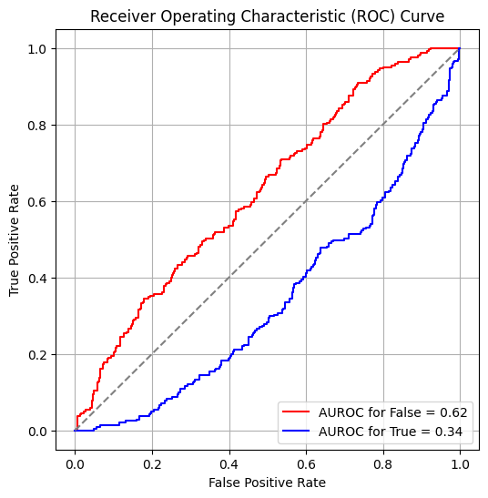
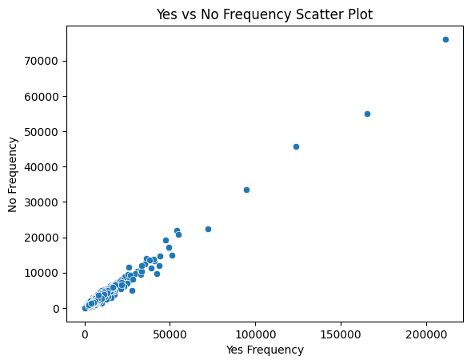
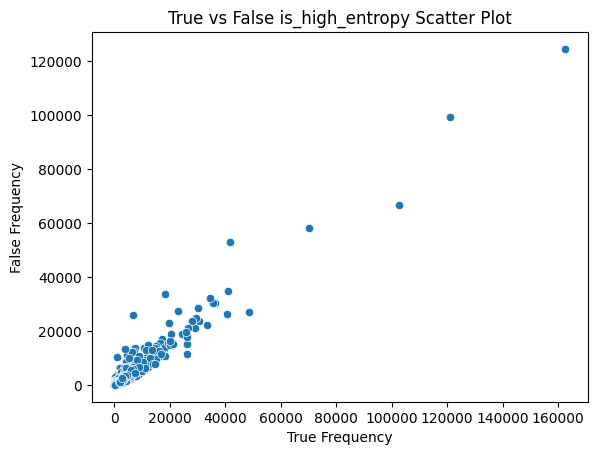

# Probabilistic Neural Network Exam
The scripts are an adaptation of [Uncertainty in LLMs](https://github.com/DhairyaKarna/uncertainity_in_LLMs/) and adapted to [TruthfulQA Dataset](https://huggingface.co/datasets/domenicrosati/TruthfulQA).

# Dataset

TruthfulQA is a Question Answering Dataset whose purpose is to elicit hallucinations from the model. The Dataset is made of 817 questions that spans 38 different topics. The questions were crafted in a way that some humans would answer falsely due to a false belief or misconception. To perform well, models must avoid generating false answers learned from imitating human texts.

# Models

The TruthfulQA questions are answered by [Gemma 2](https://huggingface.co/google/gemma-2-2b) on its 2B parameters version in a zero-shot settings.
Other model have also been used used for various purposes are:
- [TruthfulQA Truth Judge](https://huggingface.co/allenai/truthfulqa-truth-judge-llama2-7B) is a 7b Llama model trained on analyzing the responses to the TruthfulQA questions and giving a "truth" score (binary 'yes' or 'no'). It evaluates the truthfullness of other models responses to the TruthfulQA questions.
- [DeBerta MNLI](https://huggingface.co/microsoft/deberta-large-mnli) is a DeBerta model trained on the [Multi-Genre Natural Language Inference](https://cims.nyu.edu/~sbowman/multinli/) task, giving a binary classification of wheter the first part of the sequence, before the \[SEP\] entails the last part of the sequence. 
- [Sentence Transformers](https://sbert.net/) are a collection of encoder model trained for calculating similarity scores between sentences. I've used [all-mpnet-base-v2](https://huggingface.co/sentence-transformers/all-mpnet-base-v2) pre-trained sentence transformer model as an alternative of DeBerta MNLI for calculating answer distances.
- [Gemma Scope Res SAE](https://huggingface.co/google/gemma-scope-2b-pt-res) is a Sparse Autoencoder pre-trained on Gemma 2 residual stream activation. It's a Multi-layer perceptron with a hidden size 10x the hidden size of Gemma, uses a sparsity constraint in the loss and a modified activation function called JumpReLU. It's trained in reconstructing the input after projecting it into this sparse and larger latent space. It's used to disentangle the super-positioned features inside the dense latent space of the Transformer. 

# Code

## Generating Samples

`generate_responses.py` takes an argument `-l` which represents the layer of Gemma at which the Gemma Scope SAE is hooked. The script loops trough TruthfulQA and generates 5 answers per-question at temperature 1.0 and one at temperature 0.0. Each of these answers are judged by the TruthfulQA Truth Judge, and for each of these generations the SAE latent space activation are saved for further analysis. 

Then, `clean_responses.py` is launched to clean the generations from the prompt if the model repeated it in its answer.


## Generating Similarity Scores

`generate_similarities_score.ipynb` is a Jupyter notebook that, given the previously generated answers, calculates a bunch of similarity scores. 
In particular it calculates:
- Rouge Scores (rouge1, rouge2, rougeL) as a form of *syntactic similarity*;
- Semantic Sets trough DeBerta MNLI predictions. For each possible couple $(a, b)$ in the generation set of each questions (aka 10 couples), we predict wheter $a$ entails $b$ or $b$ entails $a$. If neither is the case, the two answers are placed in different "semantic sets", otherwise they join the same set. The hypothesys is that if a model is more certain about its answers they should belong to the same semantic set. 

Thes Similarity scores are then used to calculate both **uncertainty** estimate $U(x)$ or a confidence score $C(x)$. 

### Sentence Transformer Variant
`generate_similarities_scores_sentence_transformer.ipynb` is a variant of `generate_similarities_scores.ipynb` where instead of using DeBerta trained on MNLI, it uses a pre-trained Sentence Transformer which is a model specifically tailored to calculate similarity between sentence. All experiments have been done on both variant of similarity scores. 

## Uncertainty vs Confidence
Uncertainty $U$ typically depends only on the input $x$. So, e.g., $P(Y|x) = \mathcal{N}(\mu, \sigma^2)$ the variance $\sigma^2$ is an uncertainty measure. 
However Confidence measure $C$ is generally associated with both the input and the prediction $C(x,y)$, in the context of classification, one of the simplest confidence measures is just the predicted probabilty. 

## Generating an Uncertainty Estimate

`generate_uncertainty.ipynb` is a Jupyter notebook that given the generated answers calculates a measure of *total uncertainty* which should be indicative of epistemic uncertainty. The way it works is by using a prompt template such as this:
```
Question: {} \n Here are some ideas that were brainstormed:{}\n Possible answer:{}\n Is the possible answer:\n (A) True\n (B) False\n The possible answer is: True.
```
This is done in a few shot settings, before this is appended a couples of examples with the correct prediction. Then, everything is masked, with the exception of the "True" token, so that we can see the loss of the model w.r.t this injected prediction (i.e. we always inject the token "True", wheter or not the answer is true).   
This loss is calculated for a good sample of the dataset 800/817 (the others are used as few-shot examples), and then transformed to *probability estimates* of the model uncertainty towards that prediction by the means of $exp(-loss)$. 

These values are used, togheter with the true labels, for calculating an AUROC score as a total uncertainty measure of the model prediction of the "True" label. This was also done for the "False" label. 

## Generating Confidence Measures

`generate_log_likelihoods.ipynb` is a Jupyter notebook used to do a bunch of calculation before actually generating confidence measures with `generate_confidence.ipynb`. 

In particular, `generate_log_likelihoods.ipynb` calculates:
- Average Negative Log Likelihood (NLI) calculated for each generations. Basically it calculates the loss for any of the answers by doing a forward pass trough the model (ignoring the prompt for the purpose of calculating the loss). This gives a measure of how likely is the model to generate that sentence given the prompt. 
- Average Unconditioned NLL is the same as above, but without providing the prompt. Aka how likely is the model to generate that sentence without the context of the prompt. 
- Pointwise Mutual Information (PMI) between the NLL and the Uncoditioned NLL. It gives a measure of how much more informative the prompt is to generate the sequence compared to generating it without it.
- Hidden state of the last layer are also saved. 

This calculations are done for all the generations. `generate_confidence.ipynb` calculates a bunch more measure starting from these ones, in particular: 
- Average PMI;
- Mutual Information;
- Variance of NLL;
- Mean of NLL;
- Predictive Entropy;
- Predictive Entropy across Concepts; 
- Margin Probability Uncertainty; 

This is calculated on the whole dataset and also on different subsets. Then, all the calculated measures are aggregated and reported on a json file using `result.ipynb` and `result_SAE.ipynb`. 

# Results and Comments

I divided the results into three categories: the uncertainty measure results, the confidence measures results, and the SAE activations analysis. In each of these I commented the major findings or interesting stuff. 

## Uncertainty Measures

For the Uncertainty Measure I calculated the loss of the token that the model uses in prediction. Particularly I used the template presented in [its code section](#generating-an-uncertainty-estimate) and saw wether the loss of the final "True" token was predictive of the correct answer actually being true. I did this for both "True" and "False" prediction, and calculated the AUROC:



Here we can see that we have a low AUROC for the "True" prediction (0.32). Meaning that the model's loss isn't as capable as distinguishing when the "True" token should, or shouldn't be there. This means that "True" token's prediction are uncertain and shouldn't be trusted as much as the "False" ones, where we see that the AUROC reaches 0.62. Meaning that the model is much more certain on when to use the "False" tokens w.r.t of the "True" one. 

## Confidence Measures

We first calculate the Lenght-Normalized and the non-normalized version of the **Predictive Entropy**, and evaluate its AUROC.
The predictive entropy is calculated as:  
$$H[p(y|x)] = - \sum_i p(y_i|x)\log p(y_i|x)$$  
where p(y_i|x) is the likelihood and it's calculated as the average likelihood across all five examples:  
$$\log(\frac{1}{M}\sum_{m=1}^M p_m(x))$$  

The Length-Normalized one is calculated by using the average negative log-likelihood of the generation, while the unnormalized version on the total loss of the generation. We can see that both have an AUROC around 0.5 meaning that the model is uncertain about its prediction. So, while having a task accuracy of 0.7, the model doensn't seem sure about its predictions. 

The Average RougeL tells us that the generations are somewhat different between them. 


|            Task Accuracy           | 0.70 |
|:----------------------------------:|------|
| LenNorm Predictive Entropy AUROC   | 0.47 |
|      Predictive Entropy AUROC      | 0.54 |
| Negative Log-Likelihood AUROC      | 0.54 |
| Average RougeL between generations | 0.11 |

This is also true by using other *semantic* similarity score. I used both the DeBerta MNLI entailment technique proposed in the paper, and more modern similarity assessement techinque, by using the Sentence Transformer SBERT, which is fine-tuned to provide similarity scores between texts. By looking at the number of *semantic sets*, which are sets containing sentences which broadely are semantically similar, we can see that using both techniques we find an average number of 2 to 3 sets on 5 generations. 
These still indicate a poor confidence in the model's answers with AUROC near 0.5.


|                                  | MNLI | Sentence Transformers |
|----------------------------------|------|-----------------------|
| N of Semantic Sets Auroc         | 0.49 | 0.52                  |
| Avg N Semantic Sets in Correct   | 2.25 | 3.39                  |
| Avg N Semantic Sets in Incorrect | 2.20 | 3.47                  |
| Entropy over Concepts            | 0.50 | 0.49                  |


## SAE activations analysis

During generation a pre-trained Sparse Autoencoder was attached to layer 20 of the Gemma generating model. The layer was choseen because was the one with the lowest reconstruction error on the SAE, meaning that it is the layer that the Sparse Autoencoder has learned to disentangle and reconstruct effectivelly. 
While generating I saved the SAE latent layer activations for each generations. All token's, prompt inclued, activations were saved. 

The first thing I've tried was to see if there were any correlation between the latent firing of the SAE when generating an answer and the Truth judgements from the answer Judge. Meaning, if there were any latent direction that were being disentangled that encoded the fact that the model was hallucinating. 



By plotting the frequency of activation of the latent that fired for answer judged as true, and those judged as false, we can see that there aren't any latent direction that encode this information for true nor for false generations. Meaning I couldn't find a direction that expressed the model's "belief" that the answer was either true or false. 

I also tried to correlate these latent activation with the predictive entropy of the sentence. Each sentence was labeled by binning the predictive entropy against its mean in the dataset: 
```python
comprehensive_dataframe['is_high_entropy'] = comprehensive_dataframe['predictive_entropy'] > comprehensive_dataframe['predictive_entropy'].mean()
```

Then I plotted again the frequency of activation of the latents in "high_entropy" sentences vs "low entropy" sentences:



While no latent was blatantly firing for either High or Low entropy, there was some that seemed to fire more frequently for low entropy sentences w.r.t. to high entropy sentences. 

I extrapolated the direction and, by using [neuronpedia page of that latent](https://www.neuronpedia.org/gemma-2-2b/20-gemmascope-res-16k/5651), I tried to look what kind of *meaning* that latent could be representing. By looking at the top activating texts during pre-training it seems to be related to calculations and mathematical expressions related to measurements and comparisons. 
